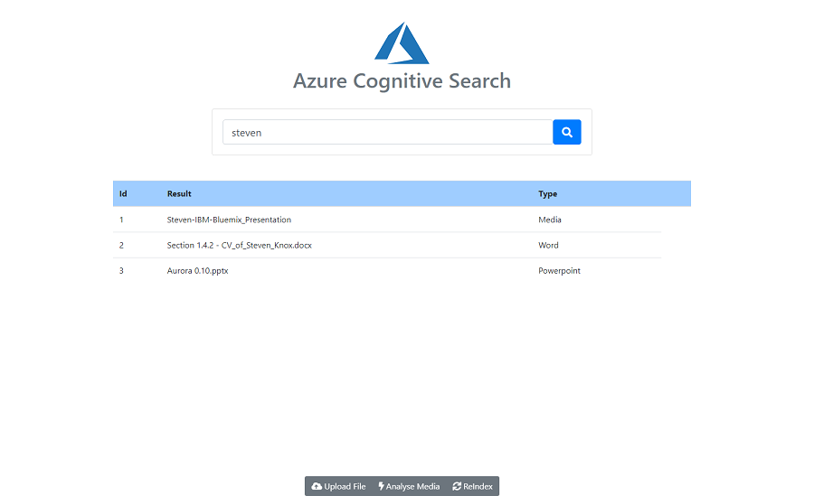

# Azure Cognitive Search Demo Applications



These demo applications show using Azure to create an intelligent search for:

- Structured Text (Json Files)
- Unstructed Text (document and images files stored on Azure Blob Storage)
- Media/Video Files (Analysed using Azure Media Services and extracted Transcripts uploaded to Azure Search)
- Build a Web UI to interact with Azure Search features

The 'AzureSearch' project is a C# console application that can be used to create and manage indexes on Azure search for Text, Files (stored on Azure Blob Storage) and Media (analysed using Azure Media Services).

The console application also allows searching the different indexed content and uploading files and media to Azure Blob Storage and Azure Media Services.

To run the application you need to replace the azure credentials and endpoints with your own. I created a .azure-credentials folder in the root of the solution with several text files that contained keys and endpoints for simplicity.

````
storage.private-azure-key
search.private-azure-key
media.private-azure-key
functions.azure-endpoint
````

The 'WebApp' project is a simple SPA application for interacting with Azure Search (Asp.Net Core, Signalr, Typescript, Webpack, Bootstrap 4)

The Web application references the console application and calls into the search methods.

To run the web application from the CLI for the first time, navigate to the WebApp folder and run:

````
dotnet build
npm install
npm run build
````

This will startup webpack and watch the client assets for changes (everything under src/)

Next startup the ASP.NET Core app, open a new termnial in the WebApp root and run

````
dotnet watch run
```

This will startup the web server, you should now be able to load up the web app in your browser (usually https://localhost:5001)

You will need to have indexed some content using the console application for the search to pick up any results.

## Core Technologies

- Azure Search
- Azure Blob Storage
- Azure Media Servces
- Azure Search and Storage SDK's
- Azure Functions
- ASP.NET Core + SignalR 
- Typescript + Webpack + SignalrR client + Bootstrap 4